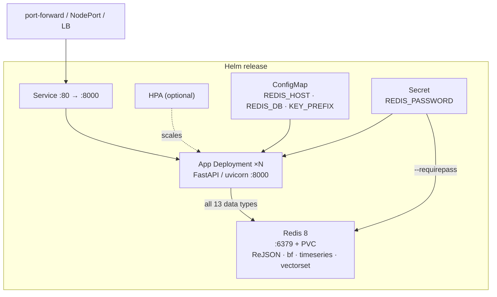

# fastapi-redis — Helm Chart

Helm chart for deploying [fastapi-with-redis](https://github.com/sany2k8/fastapi-with-redis) —
a FastAPI service exercising all 13 Redis data types — together with the Redis 8 instance it
needs.

## How this repo is used

**This repo is ArgoCD's source of truth — committing here is deploying.** The
[argocd-bootstrap](https://github.com/sany2k8/argocd-bootstrap) repo holds an `Application`
that watches this repo and keeps its namespace matching `values-dev.yaml`.

- **Do not `helm install` into a namespace ArgoCD manages.** You would get a second, parallel
  release next to ArgoCD's. The commands below are for a throwaway namespace.
- **`app.image.tag` in `values-dev.yaml` is machine-written.** CI in the application repo
  rewrites it on every push to `main` and commits it here. Hand edits are overwritten.

## What gets deployed

| Component | Kind | Notes |
|---|---|---|
| **App** | Deployment + Service | FastAPI on port 8000 (`ghcr.io/sany2k8/fastapi-with-redis`) |
| **Redis** | Deployment + Service + PVC | **Redis 8**, password-protected; can be disabled for an external instance |
| **Config** | ConfigMap | `REDIS_HOST`, `REDIS_PORT`, `REDIS_DB`, `APP_ENV`, `KEY_PREFIX` |
| **Credentials** | Secret | `REDIS_PASSWORD` — read by both the app and the Redis server |
| **HPA** | HorizontalPodAutoscaler | Optional; needs metrics-server |
| **Tests** | Pod (Helm test) | Health, module check, and a full 13-type demo run |

Config and Secret contents are hashed into the pod template, so changing a value rolls the
pods automatically instead of leaving them on stale env vars.

## Two things this chart gets right, that are easy to get wrong

**Redis 8 modules only load if the image's entrypoint runs.** The app needs `ReJSON`, `bf`,
`timeseries` and `vectorset`. Setting `command: ["redis-server"]` on the container overrides
the image's `docker-entrypoint.sh` — and then **only `vectorset` loads**, so every JSON,
Bloom and Time Series endpoint fails with "unknown command" while Redis itself looks
perfectly healthy. This chart passes `args` only and lets the entrypoint run. Verify with:

```bash
kubectl exec deploy/<release>-redis -- sh -c 'REDISCLI_AUTH=<pw> redis-cli MODULE LIST'
```

**Liveness must not depend on Redis.** `GET /health` pings Redis, so it is the right
readiness probe and the wrong liveness probe: a Redis outage would make Kubernetes restart
healthy API pods in a loop. Liveness uses `app.probes.livenessPath` (`/openapi.json`, served
by FastAPI itself); readiness and startup use `app.probes.path` (`/health`).

## Prerequisites

- Kubernetes 1.24+ and `kubectl`
- Helm 3 or 4
- The app image must be **pullable by the cluster** — either make the GHCR package public, or
  set `app.imagePullSecrets` (see below)
- metrics-server, only if `autoscaling.enabled: true`

## Quick start (standalone, throwaway namespace)

```bash
helm upgrade --install fr . -f values-dev.yaml -n fr-test --create-namespace
kubectl -n fr-test rollout status deploy/fr-app

kubectl -n fr-test port-forward svc/fr-app 8000:80
curl localhost:8000/health           # redis up? which modules are loaded?
curl localhost:8000/demo/scenario    # exercises all 13 data types
open http://localhost:8000/docs

helm test fr -n fr-test
helm uninstall fr -n fr-test && kubectl delete ns fr-test
```

## Environment profiles

| Profile | File | Use case |
|---|---|---|
| **Development** | `values-dev.yaml` | 1 replica, ephemeral Redis, no HPA — this is the file ArgoCD renders |
| **Production** | `values-prod.yaml` | 3 replicas, persistent Redis, HPA, pod anti-affinity |

## Configuration

Defaults live in [`values.yaml`](values.yaml); `helm show values .` prints them.

```yaml
app:
  replicaCount: 1
  image:
    repository: ghcr.io/sany2k8/fastapi-with-redis
    tag: ""                      # empty = Chart.appVersion
  containerPort: 8000            # uvicorn's port
  imagePullSecrets: []           # e.g. [{name: ghcr-creds}] for a private image
  probes:
    path: /health                # readiness + startup: pings Redis
    livenessPath: /openapi.json  # liveness: no dependencies
  config:
    APP_ENV: production
    KEY_PREFIX: rdp              # every key the app writes starts with this
    REDIS_DB: "0"

redis:
  enabled: true                  # false = point the app at an external Redis
  image:
    tag: "8-alpine"              # 7.x lacks the modules this app needs
  persistence:
    enabled: true
    size: 512Mi

auth:
  existingSecret: ""             # name a Secret you manage; the chart stops templating one
  redisPassword: "change-me"
```

### Private image

The GHCR package is private by default, which surfaces as `ErrImagePull` with a
`401 Unauthorized` on the pull. Either make the package public, or:

```bash
kubectl -n <namespace> create secret docker-registry ghcr-creds \
  --docker-server=ghcr.io --docker-username=sany2k8 --docker-password=<PAT-with-read:packages>
```

```yaml
app:
  imagePullSecrets:
    - name: ghcr-creds
```

The Secret is created out-of-band on purpose — it never belongs in git.

### External Redis

```yaml
redis:
  enabled: false
```

Then point the app at your instance by overriding `REDIS_HOST` / `REDIS_PORT` in `app.config`
and supplying `REDIS_PASSWORD` through `auth.existingSecret`.

## Endpoints worth knowing

| Path | What it tells you |
|---|---|
| `/health` | Redis reachable, and whether every required module is loaded |
| `/docs` | interactive API browser |
| `/demo/scenario` | runs all 13 data types end to end |
| `/demo/keys` | the keyspace those types produced |
| `/openapi.json` | served by FastAPI itself — the liveness target |

## Architecture



`REDIS_HOST` is templated from the Redis Service name, so it always tracks the release name.
The same Secret key feeds the app's `redis_password` setting and the server's `--requirepass`.

## Chart structure

```
.
├── Chart.yaml
├── values.yaml            # defaults
├── values-dev.yaml        # dev overlay — ArgoCD renders this one
├── values-prod.yaml       # prod overlay
└── templates/
    ├── app-deployment.yaml
    ├── app-service.yaml
    ├── app-hpa.yaml
    ├── redis.yaml
    ├── configmap.yaml
    ├── secret.yaml
    ├── tests/test-connection.yaml
    ├── _helpers.tpl
    └── NOTES.txt
```

## Using this chart as a template

Started from [nrmr-chart](https://github.com/sany2k8/nrmr-chart). To retarget it at another
app: chart name in `Chart.yaml` and the `fastapiredis.*` helpers in `_helpers.tpl`,
`app.image.repository`, `app.containerPort`, `app.probes.path` / `livenessPath`,
`app.config`, the dependency in `templates/redis.yaml` (or `redis.enabled: false`), the smoke
test, and `NOTES.txt`. Labels, service discovery, HPA and the checksum-triggered restarts all
follow the release name and need no edits.

```bash
helm lint . -f values-dev.yaml
helm template myapp-dev . -f values-dev.yaml | less
```

## Security

Passwords in `values.yaml` are plaintext and fine for a lab only. For anything real, create
the Secret out-of-band (SOPS, External Secrets, Vault) and set `auth.existingSecret` — the
chart then references yours and templates none.

## Related links

- **Application source:** [github.com/sany2k8/fastapi-with-redis](https://github.com/sany2k8/fastapi-with-redis)
- **Container image:** `ghcr.io/sany2k8/fastapi-with-redis`
- **GitOps setup:** [github.com/sany2k8/argocd-bootstrap](https://github.com/sany2k8/argocd-bootstrap)
