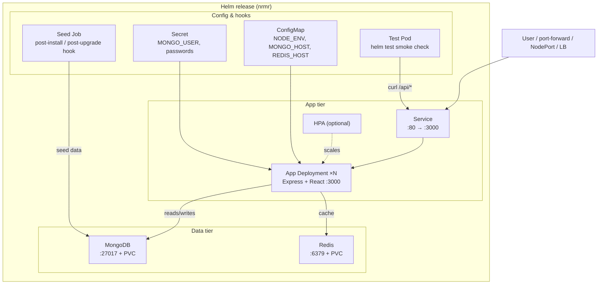
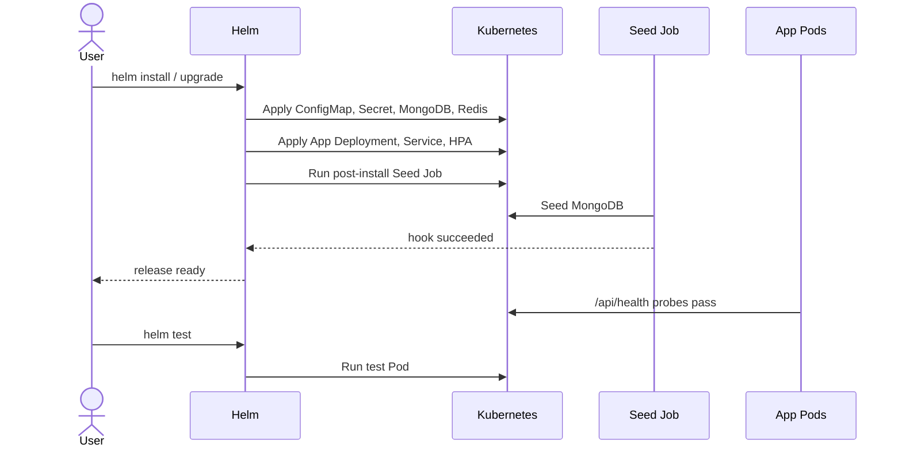

# nrmr — Helm Chart

Helm chart for deploying the full [node-react-mongo-redis](https://github.com/sany2k8/node-react-mongo-redis) stack to Kubernetes in one release: Express + React app, MongoDB, Redis, credentials, database seeding, health probes, and optional autoscaling.

## How this repo is used

**This repo is ArgoCD's source of truth — committing here is deploying.** The
[argocd-bootstrap](https://github.com/sany2k8/argocd-bootstrap) repo holds an `Application`
that watches this repo and keeps namespace `nrmr-dev` matching `values-dev.yaml`. Nobody runs
`helm upgrade` against that namespace.

Two rules follow from that:

- **Do not `helm install` into a namespace ArgoCD manages.** You would get a second, parallel
  release: `nrmr-app` alongside ArgoCD's `nrmr-dev-app`, two MongoDBs, two Redises. The manual
  commands below are for a throwaway namespace, to test the chart in isolation.
- **`app.image.tag` in `values-dev.yaml` is machine-written.** CI in the application repo
  rewrites that line on every push to `main` and commits it here. Hand edits get overwritten
  on the next build; to pin a version deliberately, change it in CI.

## What gets deployed

| Component | Kind | Notes |
|-----------|------|-------|
| **App** | Deployment + Service | Express API + React frontend (`ghcr.io/sany2k8/node-react-mongo-redis`) |
| **MongoDB** | Deployment + Service + PVC | Optional; can be disabled for an external database |
| **Redis** | Deployment + Service + PVC | Optional; can be disabled for an external cache |
| **Config** | ConfigMap | Non-sensitive env (hosts, ports, `NODE_ENV`) |
| **Credentials** | Secret | MongoDB and Redis passwords (or reference an existing Secret) |
| **Seed** | Job (Helm hook) | Seeds MongoDB on install/upgrade |
| **HPA** | HorizontalPodAutoscaler | Optional CPU/memory autoscaling for the app |
| **Tests** | Pod (Helm test) | Smoke test for health, MongoDB, and Redis |

## Prerequisites

- Kubernetes cluster (1.24+)
- [Helm 3](https://helm.sh/docs/intro/install/) or Helm 4
- `kubectl` configured for your cluster
- **metrics-server** (only if `autoscaling.enabled: true`)

## Quick start

```bash
# Clone this chart repo (or use it from a local path)
git clone https://github.com/sany2k8/nrmr-chart.git
cd nrmr-chart

# Create a namespace (optional)
kubectl create namespace nrmr

# Install with defaults
helm install nrmr . -n nrmr

# Wait for the app rollout
kubectl rollout status deploy/nrmr-app -n nrmr

# Reach the app (ClusterIP default)
kubectl port-forward -n nrmr svc/nrmr-app 8080:80

# Verify
curl http://localhost:8080/api/health
curl http://localhost:8080/api/items
curl http://localhost:8080/api/counter

# Run bundled smoke tests
helm test nrmr -n nrmr
```

After install, Helm prints post-install notes (`helm get notes nrmr -n nrmr`) with environment-specific access instructions.

## Environment profiles

*Reminder: `nrmr-dev` is ArgoCD's. Use a scratch namespace for the commands below.*

Two value overlays ship with the chart:

| Profile | File | Use case |
|---------|------|----------|
| **Development** | `values-dev.yaml` | Single replica, ephemeral MongoDB/Redis, no HPA |
| **Production** | `values-prod.yaml` | 3 replicas, persistent storage, HPA, pod anti-affinity, NodePort |

```bash
# Try the dev overlay in a throwaway namespace (NOT nrmr-dev, ArgoCD owns that)
helm upgrade --install nrmr . -n nrmr-test -f values-dev.yaml --create-namespace
helm uninstall nrmr -n nrmr-test && kubectl delete ns nrmr-test

# Production, once it is a second ArgoCD Application: commit values-prod.yaml
# and let ArgoCD apply it, rather than running helm yourself.
```

## Configuration

All defaults live in [`values.yaml`](values.yaml). Override with `-f myvalues.yaml` or `--set key=value`.

```bash
# Inspect the full values API
helm show values .
```

### Common overrides

```yaml
app:
  replicaCount: 3
  image:
    repository: ghcr.io/sany2k8/node-react-mongo-redis
    tag: v2                    # empty = Chart.appVersion
  service:
    type: ClusterIP            # ClusterIP | NodePort | LoadBalancer
    port: 80

mongodb:
  enabled: true
  persistence:
    enabled: true
    size: 1Gi

redis:
  enabled: true
  persistence:
    enabled: true
    size: 512Mi

autoscaling:
  enabled: false               # requires metrics-server
  minReplicas: 2
  maxReplicas: 8

auth:
  existingSecret: ""           # set to use a pre-created Secret
  mongoUser: appuser
  mongoPassword: "change-me"
  redisPassword: "change-me"

seedJob:
  enabled: true                # Helm hook: seeds MongoDB on install/upgrade
```

### Image tags

The app image tag defaults to `Chart.appVersion` when `app.image.tag` is empty. Bump `appVersion` in [`Chart.yaml`](Chart.yaml) to pin the default app version, or set `app.image.tag` explicitly (as in `values-dev.yaml` and `values-prod.yaml`).

## Operations

### Upgrade

```bash
helm upgrade nrmr . -n nrmr -f values-prod.yaml --wait
```

Config and Secret changes trigger a rolling update via checksum annotations on the pod template, so pods pick up new env vars without manual restarts.

### Test

```bash
helm test nrmr -n nrmr
```

The test pod checks `/api/health`, version reporting, MongoDB writes, and Redis counter access.

### Uninstall

```bash
helm uninstall nrmr -n nrmr
```

The auth Secret is retained on uninstall (`helm.sh/resource-policy: keep`) so a reinstall against existing PVCs does not mismatch credentials. Delete it manually if you want a clean slate:

```bash
kubectl delete secret nrmr-auth -n nrmr
```

### Status and notes

```bash
helm status nrmr -n nrmr
helm get notes nrmr -n nrmr
helm get values nrmr -n nrmr
```

## Accessing the app

| Service type | How to reach it |
|--------------|-----------------|
| **ClusterIP** (default) | `kubectl port-forward svc/<release>-app 8080:80` |
| **NodePort** | `http://<node-ip>:<nodePort>` — on kind clusters, port-forward or a socat bridge may be needed (see post-install notes) |
| **LoadBalancer** | Wait for `EXTERNAL-IP`: `kubectl get svc -w` |

Useful endpoints once connected:

- `GET /api/health` — liveness/readiness probe target
- `GET /api/` — app version info
- `GET /api/items` — MongoDB-backed data (seeded on install)
- `GET /api/counter` — Redis-backed counter

## Security

**Do not commit real credentials.** The default `values.yaml` uses plaintext passwords suitable for local labs only.

For production:

1. Create a Kubernetes Secret out-of-band (SOPS, External Secrets Operator, Vault, etc.).
2. Set `auth.existingSecret` to its name — the chart will stop templating a Secret and only reference yours.

```yaml
auth:
  existingSecret: nrmr-credentials
```

## Architecture



Service discovery is wired automatically: the ConfigMap sets `MONGO_HOST` and `REDIS_HOST` to in-cluster DNS names derived from the release name.

### Install lifecycle

The seed Job runs as a **post-install / post-upgrade** Helm hook so MongoDB and the auth Secret exist before seeding begins.



## Chart structure

```
.
├── Chart.yaml              # Chart metadata (name, version, appVersion)
├── values.yaml             # Default values
├── values-dev.yaml         # Dev overlay
├── values-prod.yaml        # Prod overlay
└── templates/
    ├── app-deployment.yaml
    ├── app-service.yaml
    ├── app-hpa.yaml
    ├── mongodb.yaml
    ├── redis.yaml
    ├── configmap.yaml
    ├── secret.yaml
    ├── seed-job.yaml
    ├── tests/test-connection.yaml
    ├── _helpers.tpl
    └── NOTES.txt
```

## Using this chart as a template

This repo is a GitHub template — *Use this template* gives you a working chart for a new app
rather than a `helm create` skeleton to fill in. What to change afterwards:

| Change | Where |
|---|---|
| Chart name and description | `Chart.yaml` (`name`, `description`), and the `nrmr.*` helper names in `templates/_helpers.tpl` |
| Image | `app.image.repository` in `values.yaml` |
| Port the container listens on | `app.containerPort` |
| Probe path | `app.probes.path` — must be an endpoint that touches **no** database, or a slow dependency will look like a dead app and Kubernetes will restart healthy pods |
| Dependencies | `templates/mongodb.yaml` / `templates/redis.yaml` — delete what the app does not need, or set `mongodb.enabled` / `redis.enabled` to `false` |
| Seeding | `templates/seed-job.yaml` is MongoDB-specific; replace the command or set `seedJob.enabled: false` |
| Smoke test | `templates/tests/test-connection.yaml` curls this app's `/api/*` endpoints — point it at yours |
| Post-install notes | `templates/NOTES.txt` mentions the same endpoints |
| Environment overlays | `values-dev.yaml`, `values-prod.yaml` |

Everything else — labels, service discovery, the ConfigMap/Secret wiring, rolling-update
strategy, HPA, checksum-triggered restarts — is driven by the release name and needs no edits.

Sanity-check a fresh copy before wiring ArgoCD to it:

```bash
helm lint . -f values-dev.yaml
helm template myapp-dev . -f values-dev.yaml | less
```

## Related links

- **Application source:** [github.com/sany2k8/node-react-mongo-redis](https://github.com/sany2k8/node-react-mongo-redis)
- **Container image:** `ghcr.io/sany2k8/node-react-mongo-redis`
- **Helm docs:** [helm.sh/docs](https://helm.sh/docs/)

## License

See the application repository for license details.
